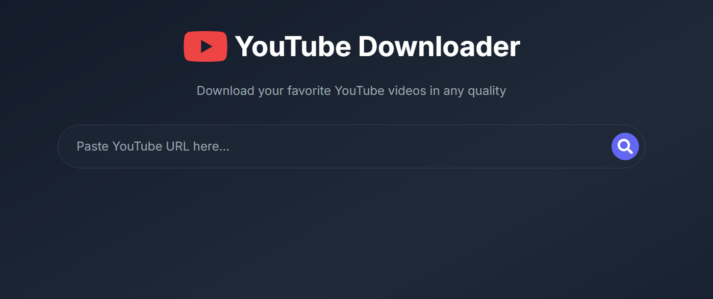

# Modern YouTube Downloader

A modern, sleek YouTube video downloader with a beautiful dark theme interface. Built using Next.js 14 for the frontend and FastAPI for the backend, supporting multiple video qualities and formats.



## Features

- 🎥 Download YouTube videos in multiple formats and qualities
- 🎨 Modern dark theme with sleek animations
- 🎯 Support for both video and audio downloads
- 📊 Detailed video information display
- 🔄 Real-time quality selection
- 📱 Fully responsive design
- ⚡ Fast downloads using yt-dlp

## Tech Stack

- **Frontend:**
  - Next.js 14
  - Tailwind CSS
  - Framer Motion
  - React Icons

- **Backend:**
  - FastAPI
  - yt-dlp
  - Python 3.8+

## Installation

1. **Clone the repository:**
   ```bash
   git clone https://github.com/themrsami/Youtube-Downloader-Reversed-Engineered.git
   cd youtube-downloader
   ```

2. **Install frontend dependencies:**
   ```bash
   npm install
   ```

3. **Install backend dependencies:**
   ```bash
   cd backend
   pip install -r requirements.txt
   ```

## Running the Application

1. **Start the backend server:**
   ```bash
   cd backend
   uvicorn main:app --reload
   ```

2. **Start the frontend development server:**
   ```bash
   npm run dev
   ```

3. Open [http://localhost:3000](http://localhost:3000) in your browser

## Usage

1. Paste a YouTube URL into the input field
2. Click the search button or press Enter
3. Select your desired video quality from the dropdown
4. Click the download button
5. Your download will begin automatically

## API Endpoints

- `POST /api/video-info` - Fetch video information and available formats
- `POST /api/download` - Get download URL for selected format

## Contributing

Contributions are welcome! Please feel free to submit a Pull Request.

## License

This project is licensed under the MIT License - see the [LICENSE](LICENSE) file for details.

## Legal Disclaimer

This tool is for educational purposes only. Please be sure to comply with YouTube's terms of service and respect content creators' rights.